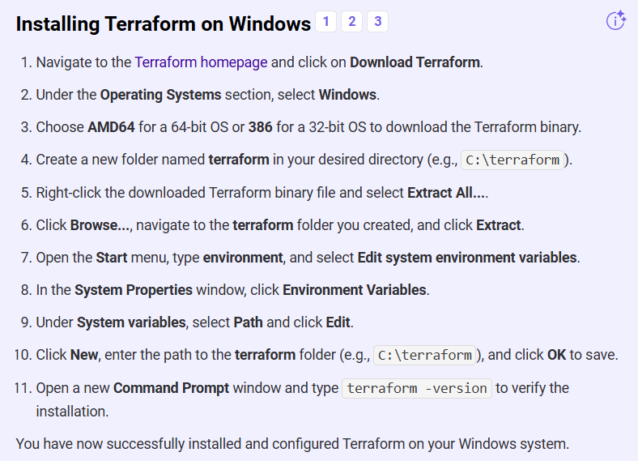

# Wymagane narzędzia:
## Terraform

## AZ CLI
Pierwsze kroki z tej strony
https://developer.hashicorp.com/terraform/tutorials/azure-get-started/azure-build
```ps
Invoke-WebRequest -Uri https://aka.ms/installazurecliwindows -OutFile .\AzureCLI.msi; Start-Process msiexec.exe -Wait -ArgumentList '/I AzureCLI.msi /quiet'; rm .\AzureCLI.msi
```
## Kubectl
Instalacja poniżej.

# Load environment variables
Jak mamy zmiennej w pliku w formacie:
```
$Env:ARM_CLIENT_ID = "<APPID_VALUE>"
$Env:ARM_CLIENT_SECRET = "<PASSWORD_VALUE>"
$Env:ARM_SUBSCRIPTION_ID = "<SUBSCRIPTION_ID>"
$Env:ARM_TENANT_ID = "<TENANT_VALUE>"
```
To wczytujemy:
```ps
Invoke-Expression (Get-Content -Raw -Path ".\<nasz plik>")
```
Sprawdzenie:
```ps
Get-ChildItem Env:
```

# Load kubectl creds.
```
az aks get-credentials --resource-group vulnerable-web-app-rg --name vulnerableWebappAKS
```

# Install kubectl
```
az aks install-cli
```

# Budowanie Infrastruktury
```ps
cd infra
terraform init
terraform apply #następnie 'yes'
```

# Budowanie Aplikacji
```ps
cd kubernetes
kubectl apply -k .
```